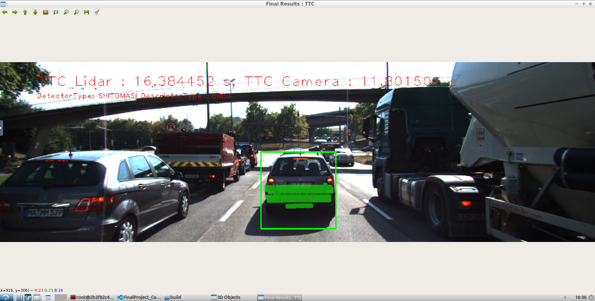
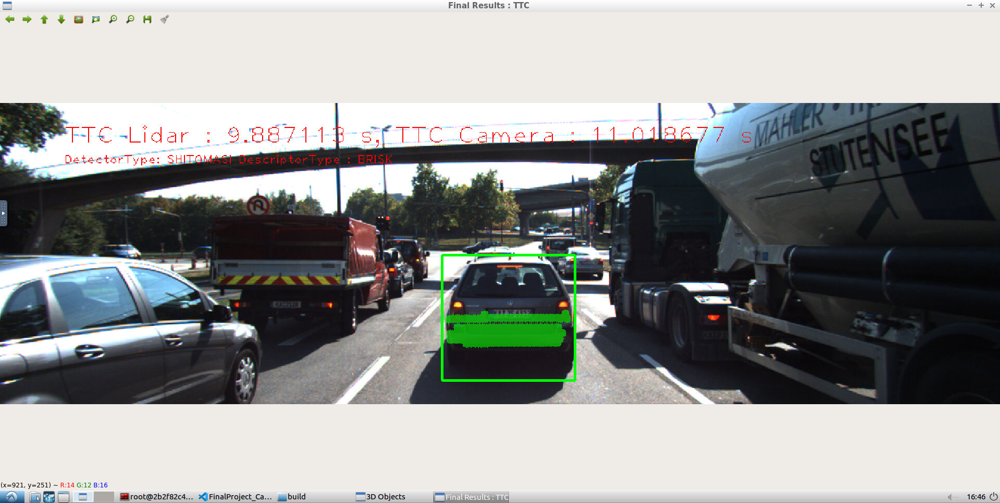
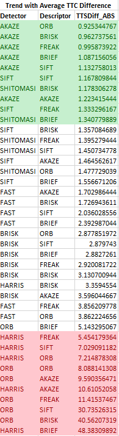
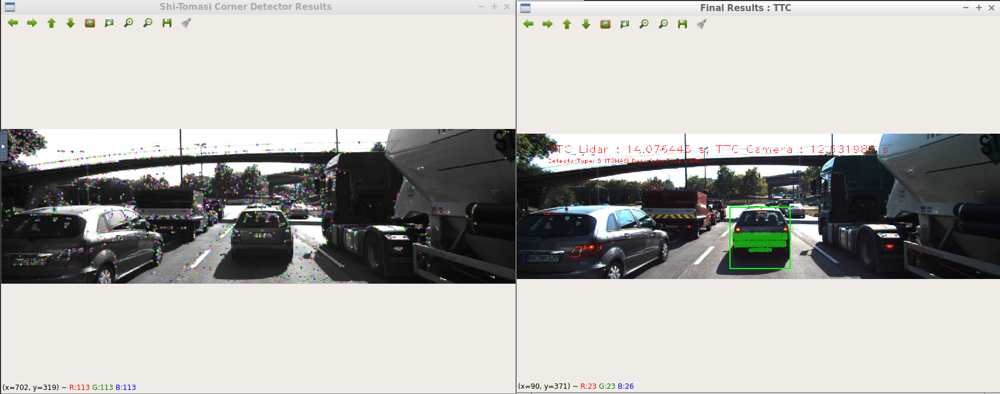

# SFND 3D Object Tracking

This is the final project of the camera course in Sensor Fusion Nanodegree program by Udacity. 
Goal of this project is to compute time to collision (TTC) by fusing 3D position information obtained from LiDAR point cloud with object detection using camera images. 
Key concepts covered:
Keypoint detectors and descriptors
Object detection using the pre-trained YOLO deep-learning framework
Methods to track objects by matching keypoints and bounding boxes across successive images
Associating regions in a camera image with lidar points in 3D space

Below flowchart gives an overview of project. 

Steps in orange box were implemented in the mid term project of course (2D Feature Tracking) and reused here.
Steps in blue box are newly implemented in this project.
For this, the following major tasks are done.
1. Developed solution to match 3D objects over time by using keypoint correspondences. 
2. Compute the TTC based on Lidar measurements. 
3. Compute the TTC with camera, which requires to first associate keypoint matches to regions of interest and then to compute the TTC based on those matches. 
4. Conduct various tests with the frameworkto identify the most suitable detector/descriptor combination for TTC estimation and also to search for problems that can lead to faulty measurements by the camera or Lidar sensor. 

## Project Dependencies 

* cmake >= 2.8
  * All OSes: [click here for installation instructions](https://cmake.org/install/)
* make >= 4.1 (Linux, Mac), 3.81 (Windows)
  * Linux: make is installed by default on most Linux distros
  * Mac: [install Xcode command line tools to get make](https://developer.apple.com/xcode/features/)
  * Windows: [Click here for installation instructions](http://gnuwin32.sourceforge.net/packages/make.htm)
* OpenCV >= 4.1
  * This must be compiled from source using the `-D OPENCV_ENABLE_NONFREE=ON` cmake flag for testing the SIFT and SURF detectors.
  * The OpenCV 4.1.0 source code can be found [here](https://github.com/opencv/opencv/tree/4.1.0)
* gcc/g++ >= 5.4
  * Linux: gcc / g++ is installed by default on most Linux distros
  * Mac: same deal as make - [install Xcode command line tools](https://developer.apple.com/xcode/features/)
  * Windows: recommend using [MinGW](http://www.mingw.org/)

## Build Instructions

1. Clone this repo.
2. Make a build directory in the top level project directory: `mkdir build && cd build`
3. Compile: `cmake .. && make`
4. Run it: `./3D_object_tracking`.

## Task Details

### FP.1 : Match 3D Objects
Implemented the method "matchBoundingBoxes", which takes as input both the previous and the current data frames and provides as output the ids of the matched regions of interest (i.e. the boxID property)“. Matches are the ones with the highest number of keypoint correspondences.
Lines 249 to 242 in camFusion_Student.cpp

### FP.2 : Compute Lidar-based TTC
Implemented the method "computeTTCLidar" which computes the time-to-collision for all matched 3D objects based on Lidar measurements alone. 
The estimation is implemented in a way that makes it robust against outliers which might be way too close and thus lead to faulty estimates of the TTC. 
Lines 223 to 246 in camFusion_Student.cpp

### FP.3 : Associate Keypoint Correspondences with Bounding Boxes
Implemented the method "clusterKptMatchesWithROI" which identifies all keypoint matches that belong to each 3D object.
It is done by simply checking whether the corresponding keypoints are within the region of interest in the camera image. 
All matches which satisfy this condition are added to a vector. To elimimate outliers, a robust mean of all the euclidean distances between keypoint matches is computed and then the matches that are too far away from the mean are removed.
Lines 139 to 175 in camFusion_Student.cpp

### FP.4 : Compute Camera-based TTC
Implemented the method "computeTTCCamera" to compute the TTC estimate with respect to Camera images alone. The method uses distance ratios on keypoints matched between frames to find the rate of scale change within an image. This rate of scale change is used to estimate the TTC.
TTC = (-1.0 / frameRate) / (1 - medianDistRatio); 
Here also, outliers are removed using median distance ratio.
Lines 178 to 221 in camFusion_Student.cpp
 
### FP.5 : Performance Evaluation 1
In this step, two cases where the Lidar-based TTC estimate is way off are identified. 
For this, visual check method is used. 
Case 1 - Frame 3: Lidar based TTC jumped from 13.35 to 16.38.

Case 2 - Frame 17: Lidar based TTC jumped from 11.96 to 9.88.

This issue could have been caused as calculated mean could shifted away from actual points.

### FP.6 : Performance Evaluation 2
In last step, different detector / descriptor combinations are executed  on a frame-by-frame basis to get the differences in TTC estimation. 
Then, which methods perform best are identified.  
To ease this evaluation activity, loops to iterate over vectors of detectors and descriptors are implemented.
Results are programmatically written to a CSV file. This implemention is done in FinalProject_Camera.cpp
Later, the generated data is imported in MS Excel for further analysis and plotting graphs.
These files are available in "results" folder.

Considering Average absolute TTC difference of all frames, sorted list of detector/descriptor combinations is as below:

Certain detector/descriptor combinations, especially the Harris and ORB detectors, produced unreliable camera TTC estimates. 
AKAZE, SIFT, SHITOMASI and FAST detectors produced reliable results.

Here is an example, where camera-based TTC estimation is way off. 

We can see that the 3D bounding box, includes points on the road as well and this results in less accurate results.